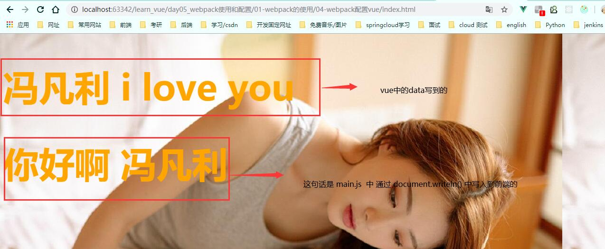

# 安装各loader

1. css
```$xslt
npm install --save-dev css-loader@2.0.2
npm install --save-dev style-loader@0.23.1 --force
```
1. less
```$xslt
npm install less-loader@4.1.0 less@3.9.0 --save-dev --force
```
3. 图片
```$xslt
npm install url-loader@1.1.2 --save-dev --force
npm install file-loader@3.0.1 --save-dev --force
```

4. babel
```$xslt
npm install -D babel-loader @babel/core @babel/preset-env
```

5. vue

```$xslt
npm install --save-dev vue
```

# 二、配置vue
下面是从 main1.js 一步一步 走到 main4.js 中，最后是正常的开发 main1.js  

每次打包都是默认打包的 main1.js ,因为 在 webpack.config.js 配置文件中  
已经配置好了webpack的入口文件和出口目录了

这个 webpack 配置vue，也可以说整合 vue， 是在 上个测试项目 webpack配置loader 的基础上开始的，所以也是先执行了标题一的各个loader

## 1. main1.js 初始化显示
vue 安装完成，开始使用

在 main1.js 中，按以前的方式使用，引入vue, 并实例化  
定义一个data.message 并在 index.html 进行显示  
main1.js （打包时是 main1.js）
```js
const app = new Vue({
  el: '#app',
  data: {
    // 这里的 message  可以在 index.html 中使用，那里被注释了
    message: '冯凡利 i love you'
  }
})
```
index.html
```html
<!DOCTYPE html>
<html lang="en">
<head>
  <meta charset="UTF-8">
  <title>04-webpack配置vue</title>
</head>
<body>
<div id="app">
  <h2>{{message}}</h2>
</div>

<script src="./dist/bundle.js"></script>
</body>
</html>
```

npm run build 打包成功

浏览器中，没有显示message 信息，而且 console 报错了，如下


先了解这两个模式：  
runtime-only -> 代码中，不可以有任何的template，
runtime-compiler -> 代码中，可以有template ，因为游compiler 可以用于编译 template 

所以 需要在 webpack.config.js 配置文件中 指定 vue 的路径  
也就是在 main1.js 中 导入（import） vue 时，去 webpack.config.js 配置文件中，看是否有指向的某个文件夹
```$xslt
  resolve: {
    // alias： 别名， $： 以vue为结尾的
    alias: {
      'vue$': 'vue/dist/vue.esm.js'
    }
  }
```
resolve 与 entry、output、module 同级

然后 npm run build 打包成功  
打开浏览器显示成功



## 2. SPA 模式：单页面应用
SPA 是 simple page web application ,一个单页面应用  
也就是只有一个 index.html 页面，并且内容不写在这里面。

将上一个案例的初始化中的 index.html 中的数据渲染提取出来，放到 main2.js 中的组件中

template 中的 div  会自动替换 index.html 中的 div。

main2.js
```js
// 相比于 main2.js ，这里把 内容放到了 template 中

const app = new Vue({
  el: '#app',
  // 这里 替换了 index.html 中的 div
  template: `
    <div>
      <span>{{message}}</span>
      <button>按钮</button>
      <span>{{name}}</span>
    </div>
  `,
  data: {
    message: '冯凡利 i love you',
    name: '冯安晨'
  }
})
```

index.html, 这个页面 里面一般不会在动了。
```html
<!DOCTYPE html>
<html lang="en">
<head>
  <meta charset="UTF-8">
  <title>04-webpack配置vue</title>
</head>
<body>
<div id="app">
<!--  <h2>{{message}}</h2>-->
</div>

<script src="./dist/bundle.js"></script>
</body>
</html>
```

打包 npm  run build ,并查看页面如下：


## 3. 提取main。js 中的html 出来

将页面的展示，提取出来，封装成一个模块，还提取了其中的数据。

main3.js
```js
const App = {
  template: `
    <div>
      <span>{{message}}</span>
      <button @click="btnClick">按钮</button>
      <span>{{name}}</span>
    </div>
  `,
  data(){
    return {
      message: '冯凡利 i love you',
      name: '冯安晨'
    }
  },
  methods: {
    btnClick(){
      console.log('btnClick')
    }
  }
}

// 相比于 main2.js ，这里把 模板给抽出来 做了子组件

const app = new Vue({
  el: '#app',
  template: `<App/>`,
  components: {
    App
  }
})
```

index.html 和上一个一样，没有动过。

显示页面如下：


## 继续将模块提取出来，封装成一个 app.js 

main4.js
```js
import App from './js/app'

/*
* 相比较于 main3.js ，这里把 模板子组件 提出来单放在了一个 vue/app.js 文件中。
* */
const app = new Vue({
  el: '#app',
  template: `<App/>`,
  components: {
    App
  }
})
```

app.js
```js
export default {
  template: `
    <div>
      <span>{{message}}</span>
      <button @click="btnClick">按钮</button>
      <span>{{name}}</span>
    </div>
  `,
  data(){
    return {
      message: '冯凡利 i love you',
      name: '冯安晨'
    }
  },
  methods: {
    btnClick(){
      console.log('btnClick')
    }
  }
}
```

index.html 没变

显示如下


## 4. 继续将 app.js 封装成一个 vue文件

main.js
```js
// import App from './vue/app'
import App from './vue/App'

/*
* 这里多了一个 .vue 文件，所以要加一个 loader。
* */


/*
* 相比较于 main4.js ，
* 这里把 提出来的组件 vue/app.js ，进行了模板 与 js 分离，
* 写了一个新的文件 vue/App.vue，把模板组件给提出来了。
* */
const app = new Vue({
  el: '#app',
  template: `<App/>`,
  components: {
    App
  }
})
```


这里将app.js  改为一个vue 格式的文件，如下：
App.vue
```vue
<template>
  <div>
    <span>{{message}}</span>
    <button @click="btnClick">按钮</button>
    <span>{{name}}</span>
  </div>
</template>

<script>
  export default {
    name: "App",
    data(){
      return {
        message: '冯凡利 i love you',
        name: '冯安晨'
      }
    },
    methods: {
      btnClick(){
        console.log('btnClick')
      }
    }
  }
</script>

<style scoped>

</style>
```

index.html 与以前一样。

这里需要注意的是，原来添加一个css、less等文件的时候，需要引入对应的loader进行转化

那这里也需要一个vue的loader进行转换。

需要安装 vue-loader、vue-template-compiler 这两个loader

然后打包显示如下：  
这里面写了一个 Cpn 的子组件


# 四、安装vue 的loader 的问题

```$xslt
npm install vue-loader@13.0.0 vue-template-compiler@2.5.21 --save-dev 
```

报错
```vue
ERROR in ./src/vue/App.vue
Module build failed: Error:

Vue packages version mismatch:

- vue@2.6.12
- vue-template-compiler@2.5.21

This may cause things to work incorrectly. Make sure to use the same version for both.
If you are using vue-loader@>=10.0, simply update vue-template-compiler.
If you are using vue-loader@<10.0 or vueify, re-installing vue-loader/vueify should bump vue-template-compiler to the latest.

```

版本问题  
vue 的版本 2.6.12   
这里的vue-template-compiler 版本为 2.5.21  

这两个应该一致才可以，所以将 vue-template-compiler 版本改为 2.6.12 ，与 vue 的版本保持一致 ，即可。

最终的 命令为
```$xslt
npm install vue-loader@13.0.0 vue-template-compiler@2.6.12 --save-dev 
```