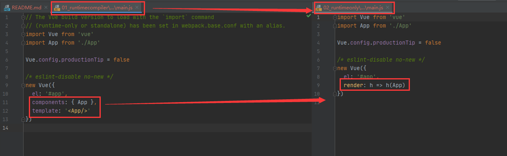
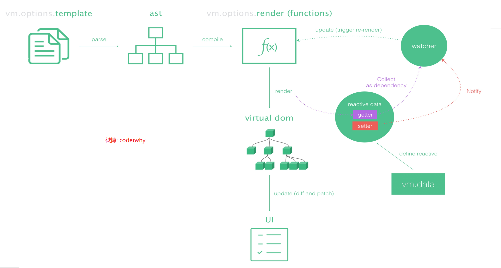

# 一、Runtime+Compiler 与 Runtime-only 的区别

脚手架安装vue项目的时候，有一个选项，Runtime+Compiler 和 Runtime-only ，只能选择一个，如下图所示：

这里推荐使用 第一个 Runtime + Compiler
本项目01_runtimecompiler也是选择的第一个
下一个项目02_runtimeonly选择的第二个
这两个唯一的区别是在 main.js 中，如下图所示：

1. 左边
   是将 APP 组将注册到 components 中，然后在 template 中渲染，替换 el 中 #app 的位置进行渲染。

2. 右边
    使用render 函数进行渲染。

# 二、Vue程序运行过程
从官网抠来一张图，如图所示

运行过程是：
1. template的模板存放到 vue 的 option 中，
2. 然后 parse（解析） 成 ast(abstract syntax tree 抽象语法树)
3. 在编译，然后使用 render() 方法
4. 通过render() 生成 虚拟dom ,在展现成 UI。
5. 总结下：template -> ast -> render -> vdom -> UI

# 三、 Runtime+Compiler 与 Runtime-only 的 实质性区别
通过 上面了解到， 两个模式的区别如下：
```$xslt
runtime-compiler(v1)
template -> ast -> render -> vdom -> UI

runtime-only(v2)(1.性能更高 2.下面的代码量更少)
render -> vdom -> UI
```
可以看到 runtime-only 比 Runtime+Compiler 1. 性能更高 2.下面的代码量更少

当然： runtime-compiler 模式中，也可以使用 render() 函数，看本项目的 main.js 即可。

# 四、eslint 关闭
01_runtimecompiler\config\index.js 中 useEslint 属性，true 开启， false 关闭
