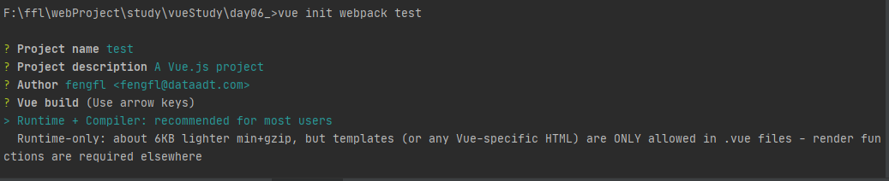
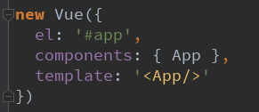
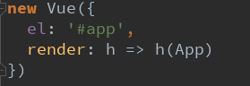
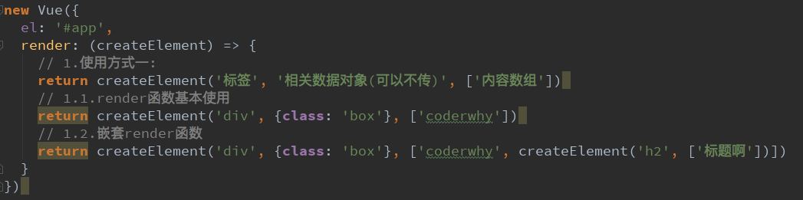
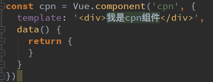
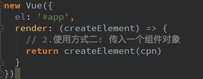

# 一、 各项目说明

## 1. 01和02 项目
1. 这两个项目 主要是讲解创建项目时 `runtimecompiler` 和 `runtimeonly` 两个模式的不同
2. `01_runtimecompiler` 和 `02_runtimeonly` 是vue-cli2 脚手架通过 `vue init webpack project_name` 创建的
    
3. 在创建过程中 的 `vue build（Use arrow keys）` 配置，  
    01 选择的是 `Runtime+Compiler  `
    02 选择的事 `Runtime-only`
4. 模式不同主要体现在两个项目中的 main.js 中的不同，如下：  
    `01_runtimecompiler`项目  
    
    `02_runtimeonly`项目
    
5. 引发思考：为什么存在这样的差异呢？
   我们需要先理解Vue应用程序是如何运行起来的。  
   Vue中的模板如何最终渲染成真实DOM。  
   我们来看下面的一幅图：`vue 程序运行过程`。  
6. Vue程序运行过程
    
7. 运行过程解析
>1. template的模板存放到 vue 的 option 中，
>2. 然后 parse（解析） 成 ast(abstract syntax tree 抽象语法树)
>3. 在编译，然后使用 render() 方法
>4. 通过render() 生成 虚拟dom ,在展现成 UI。
>5. 总结下：template -> ast -> render -> vdom -> UI

8. 总5、6、7 所述，区别如下：
    通过 上面了解到， 两个模式的区别如下：
    ```$xslt
    runtime-compiler(v1)
    template -> ast -> render -> vdom -> UI
    
    runtime-only(v2)(1.性能更高 2.下面的代码量更少)
    render -> vdom -> UI
    ```
   可以看到 runtime-only 比 Runtime+Compiler 1. 性能更高 2.下面的代码量更少  
   
   当然： runtime-compiler 模式中，也可以使用 render() 函数，看本项目的 main.js 即可。
   
9. render函数的使用
    
    
    
    
    
    
10. 推荐使用 第一个。但是在以后项目开发时，推荐使用第二个，因为 1.性能更高 2.下面的代码量更少  
    
## 2. eslint 关闭
01_runtimecompiler\config\index.js 中 useEslint 属性，true 开启， false 关闭

